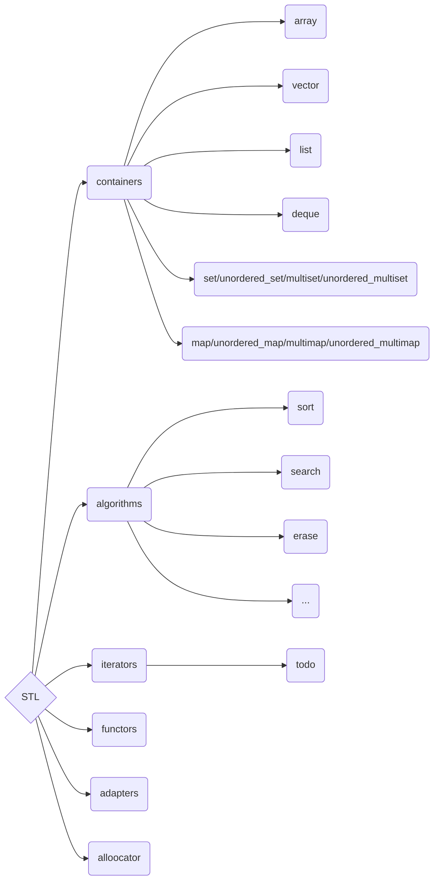

# **STL 源码解析**

## 依赖

### 本地测试环境版本 

``` shell
$ g++ --version
g++ (Ubuntu 11.4.0-1ubuntu1~22.04) 11.4.0
Copyright (C) 2021 Free Software Foundation, Inc.
This is free software; see the source for copying conditions.  There is NO
warranty; not even for MERCHANTABILITY or FITNESS FOR A PARTICULAR PURPOSE.
```

### STL源码下载

``` shell
$ git clone https://github.com/gcc-mirror/gcc.git
$ cd gcc && git checkout releases/gcc-11.4.0
$ cd libstdc++-v3
```

# STL组成



## 容器

### vector

vector(动态数组)


